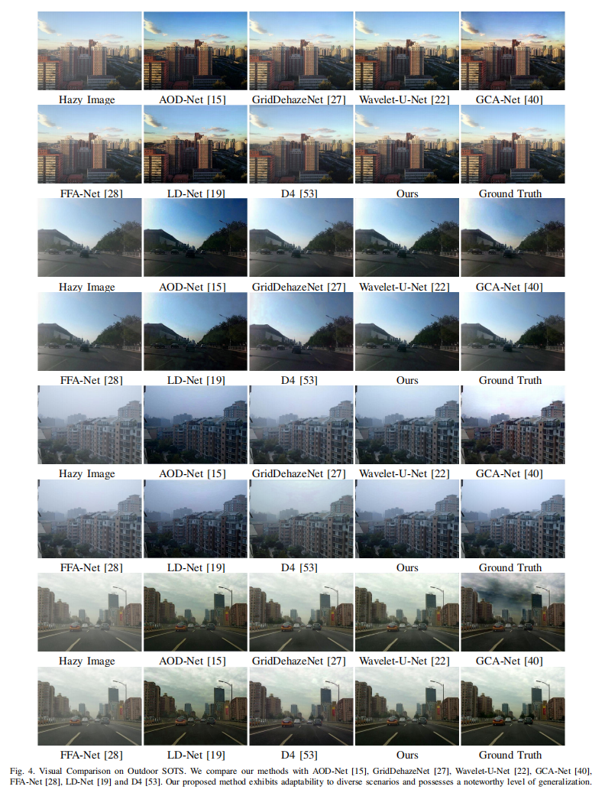
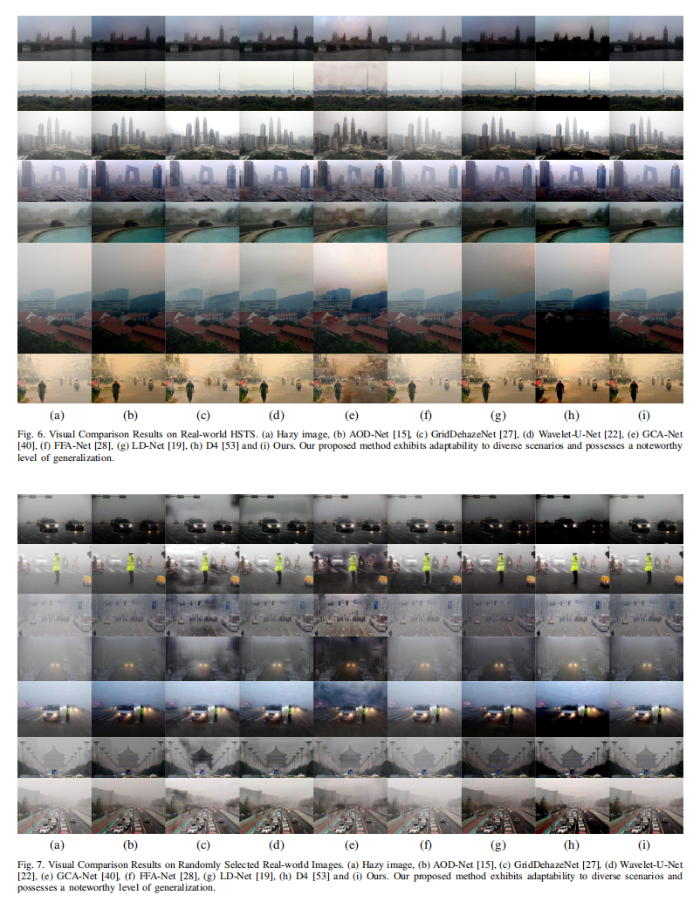
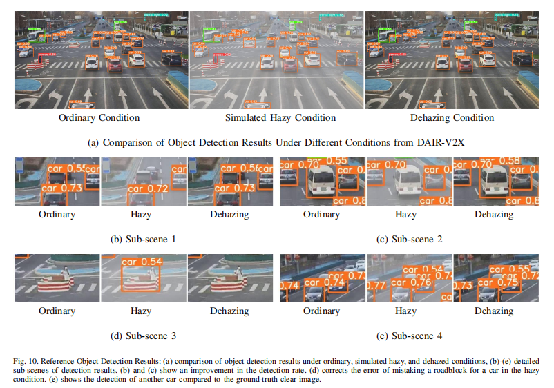
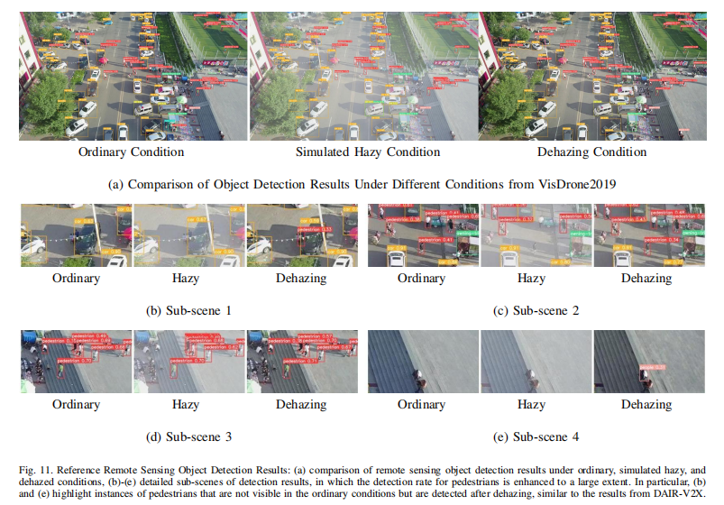

# LFD-Net

### Lightweight Feature-interaction Dehazing Network for Real-time Vision Tasks


### Dependencies

This code is developed using python 3.6.6. To install the necessary dependencies for this code, run the following command:

```bash
pip install -r requirements.txt
```

This will install all the required dependencies for the code to run properly, as follows:

```
torch==1.10.2
torchvision==0.11.3
PIL==9.4.0
matplotlib==3.3.4
opencv==4.6.0
numpy=1.19.5
```

### Training

```bash
python train.py -th haze_images/ -to original_images/ -e 50 -lr 0.001
```

### Inferencing

Place all the hazy images that need to be dehazed in the test directory and specify a destination directory for the dehazed images.

```bash
python infer_multi.py -td hazy/ -ts dehaze/ 
```

### Evaluation

To quantitatively evaluate the dehazing performance, we apply four evaluation metrics to all dehazed and ground truth image pairs: PSNR, SSIM, CIEDE2000, and SSEQ. The results of these metrics will be recorded in the file `metrics.txt`.

```bash
python evaluate.py -to gt/ -td dehaze/
```

### Experiments

All the experiments were conducted on a PC with an R9-5900HX CPU (E5-1650) and an NVIDIA RTX-3080 GPU. 

# 









### Notes

The works we have used for reference include `LD-Net`([paper](https://ieeexplore.ieee.org/abstract/document/9562276), [code](https://github.com/hayatkhan8660-maker/Light-DehazeNet)), `GCA-Net`([paper](https://ieeexplore.ieee.org/abstract/document/8658661), [code](https://github.com/cddlyf/GCANet)) and `FFA-Net`([paper](https://ojs.aaai.org/index.php/AAAI/article/view/6865), [code](https://github.com/zhilin007/FFA-Net)). Thanks for their wonderful works.
